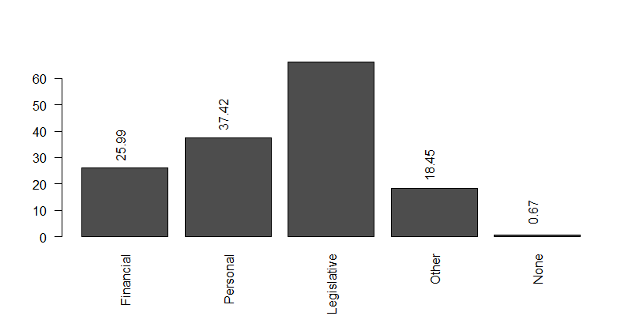

# Market Demographics

Source: [English Private Landlord Survey 2021: main report](https://www.gov.uk/government/statistics/english-private-landlord-survey-2021-main-report)

1. 94% of landlords are private
2. 43% of landlords owned one rental property, representing 20% of tenancies.
    - The remaining 18% of landlords owned five or more properties, representing almost half (48%) of tenancies.
3. 55% of landlords identified as male, whereas 44% identified as female.

## Insights

1. 20% of LLs from 2018 were reducing the number of properties held. 66.1 % of those were doing so because of legislative changes:

In contrast, 12% of LLs were increasing their portfolio, while 52% were making no changes.

2. 62.9% of LLs are getting information from government websites:

# Target Market Demographics

