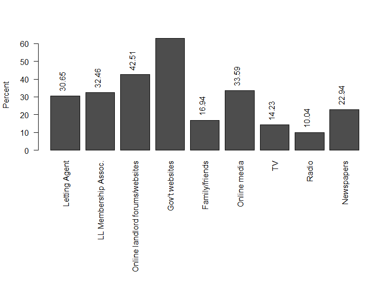

# Market Demographics

Source: [English Private Landlord Survey 2021: main report](https://www.gov.uk/government/statistics/english-private-landlord-survey-2021-main-report)

1. 94% of landlords are private
2. 43% of landlords owned one rental property, representing 20% of tenancies.
    - The remaining 18% of landlords owned five or more properties, representing almost half (48%) of tenancies.
3. 55% of landlords identified as male, whereas 44% identified as female.

## Insights

1. 20% of LLs from 2018 were reducing the number of properties held. 66.1 % of those were doing so because of legislative changes:

In contrast, 12% of LLs were increasing their portfolio, while 52% were making no changes.

2. 62.9% of LLs are getting information from government websites:

# Target Market

Defining target market as:
- Has properties rated E, F, or G
- Has less than 10 properties

1. This market makes up 18% of all LLs
    - LLs with properties rated E, F or G make up 29% of LLs
2. 47 % of these LLs have 2-4 properties
    - 29% have 5-9
    - 24% have 1 only
3. 32% of these LLs were unaware of EPC regs, compared to 30% of LLs
4. As a rough estimate, each LL has a portfolio size of about £912,550 and a current LTV of 28%
    - 40% of these LLs have no debt
    - Of LLs that have debt, their LTV is around 47%
5. These LLs own between 7 and 10% of privately let properties, which is about 12% of total privately let property value
    - This comes out to between 323,682 and 430,098 individual properties
    - With a proposed cap of £10,000 per property, this suggests a target market size of £3.2 to £4.3 Bn, most likely around £3.6 Bn
    - At an average cost of £30,000, target market size is between £9.7 and £12.9 Bn, most likely £10.8 Bn

## TAM, SAM, SOM

| Measure | Percentage | Properties | @ £10k | @ £30k |
|--------|------------|-------|--------|--------|
| TAM | 44.0%* | 10.9 m | £108.7 Bn | £326 Bn |
| SAM | 34.0%** | 1.5 m | £15.1 Bn | £45.2 Bn |
| SOM | 8.1%** | 359,154 | £3.6 Bn | £10.8 Bn |

*\*of all dwellings* 
*\*\*of privately let dwellings*